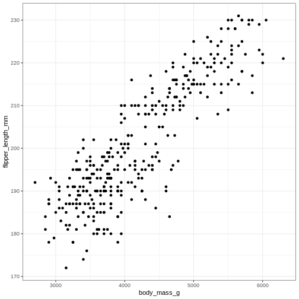
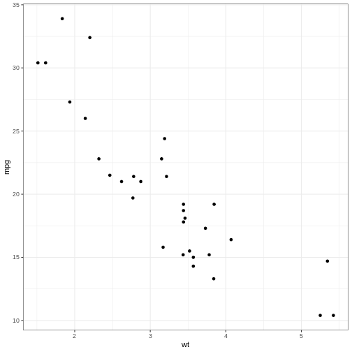

:::::::::::::::::::::::::::::::::::::: questions 

- How do you write a lesson using R Markdown and `{sandpaper}`?

::::::::::::::::::::::::::::::::::::::::::::::::

::::::::::::::::::::::::::::::::::::: objectives

- Explain how to use markdown with the new lesson template
- Demonstrate how to include pieces of code, figures, and nested challenge blocks

::::::::::::::::::::::::::::::::::::::::::::::::

## Introduction
or rather, weird and wonderfull stuff found in ggplot2.

As almost everything else in the programming world - these notes have 
been "borrowed" from others. 

https://github.com/teunbrand/ggplot_tricks - take a look, new stuff might have
appeared.

https://erikgahner.dk/2022/tips-and-tricks-for-ggplot2/

https://www.epirhandbook.com/new_pages/ggplot_tips.html

Gør kun tingene en gang.

theme_set tillader os at sætte et bestemt tema for alle efterfølgende plot.


``` r
library(tidyverse)
```

``` output
── Attaching core tidyverse packages ──────────────────────── tidyverse 2.0.0 ──
✔ dplyr     1.1.4     ✔ readr     2.1.5
✔ forcats   1.0.0     ✔ stringr   1.5.1
✔ ggplot2   3.5.1     ✔ tibble    3.2.1
✔ lubridate 1.9.4     ✔ tidyr     1.3.1
✔ purrr     1.0.2     
── Conflicts ────────────────────────────────────────── tidyverse_conflicts() ──
✖ dplyr::filter() masks stats::filter()
✖ dplyr::lag()    masks stats::lag()
ℹ Use the conflicted package (<http://conflicted.r-lib.org/>) to force all conflicts to become errors
```

``` r
library(palmerpenguins)
```


``` r
theme_set(
  theme_bw()
)
```


``` r
penguins %>% 
  ggplot(aes(body_mass_g, flipper_length_mm)) +
  geom_point()
```

``` warning
Warning: Removed 2 rows containing missing values or values outside the scale range
(`geom_point()`).
```



Den der aes() funktion - hvad gør den egentlig?


``` r
my_mapping <- aes(x = wt, y = mpg)
my_mapping
```

``` output
Aesthetic mapping: 
* `x` -> `wt`
* `y` -> `mpg`
```
Det giver jo fin mening - x i plottet skal mappes til "wt", og y til "mpt".

Hvad ellers?


``` r
class(my_mapping)
```

``` output
[1] "uneval"
```
uneval? wtf?! Nærlæser man, finder man ud af at det er en klasse der bruges til at 
gemme udtryk der ikke er evaluerede, men som skal evalueres i en bestemt kontekst.


``` r
str(my_mapping)
```

``` output
List of 2
 $ x: language ~wt
  ..- attr(*, ".Environment")=<environment: R_GlobalEnv> 
 $ y: language ~mpg
  ..- attr(*, ".Environment")=<environment: R_GlobalEnv> 
 - attr(*, "class")= chr "uneval"
```
Ikke overraskende er det en liste. Det er det ofte.

det kan man godt dykke dybere ned i.

Nå. Men my_mapping er altså en samling af uevaluerede udtryk, samlet i en 
liste.

Ønsker vi at pille dem ud, kan vi "splice" dem. 

det kan vi dog kun i bestemte kontekster. den interessante er aes:


``` r
aes(!!!my_mapping)
```

``` output
Aesthetic mapping: 
* `x` -> `wt`
* `y` -> `mpg`
```
Det gør det muligt at sætte flere sammen:


``` r
my_other_mapping <- aes(color = am)
```


``` r
aes(!!!my_mapping, !!!my_other_mapping)
```

``` output
Aesthetic mapping: 
* `x`      -> `wt`
* `y`      -> `mpg`
* `colour` -> `am`
```


``` r
mtcars %>% ggplot(aes(!!!my_mapping)) + geom_point()
```




Det tillader os at sætte forskellige mappings sammen:


``` r
my_other_mapping <- aes(colour = qux)
aes(!!!my_mapping, !!!my_other_mapping) 
```

``` output
Aesthetic mapping: 
* `x`      -> `wt`
* `y`      -> `mpg`
* `colour` -> `qux`
```

Og hvad kan man bruge det til?

Her er et eksempel, der bruger et andet trick:


my_fill <- aes(fill = after_scale(alpha(colour, 0.3)))

ggplot(mpg, aes(displ, hwy)) +
  geom_point(aes(colour = factor(cyl), !!!my_fill), shape = 21)
  
  
after_scale() giver forsinket evaluering. her evalueres det efter der er 
kørt en scalering på factoren. Og som sætter fill til den farve som
geom_point har valgt for os - med en justering af alpha. Det ser neat ud!


  
::::::::::::::::::::::::::::::::::::: keypoints 

- Use `.md` files for episodes when you want static content
- Use `.Rmd` files for episodes when you need to generate output
- Run `sandpaper::check_lesson()` to identify any issues with your lesson
- Run `sandpaper::build_lesson()` to preview your lesson locally

::::::::::::::::::::::::::::::::::::::::::::::::

