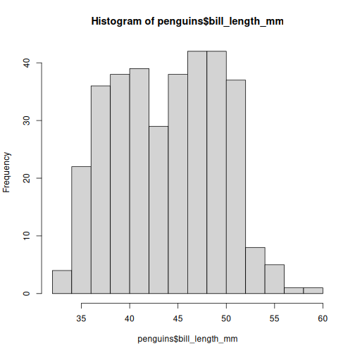
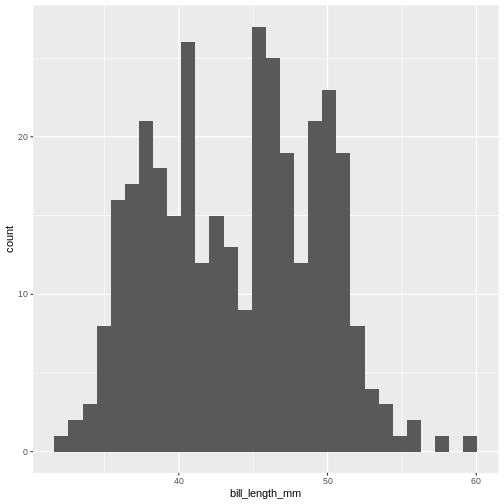
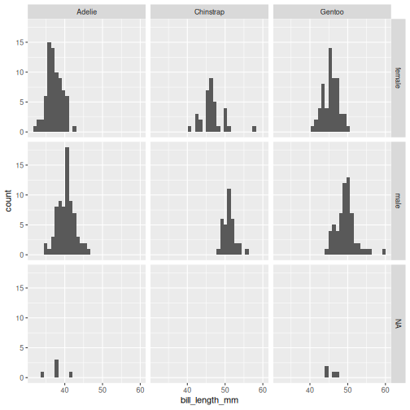
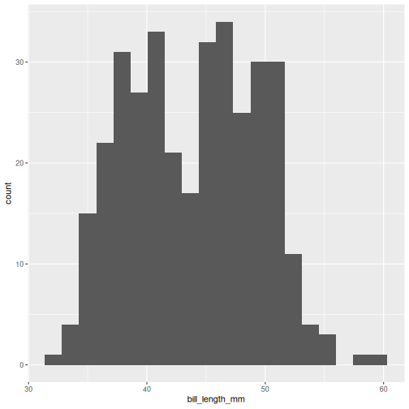
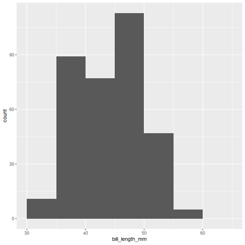

::::questions
  - What is a histogram?
  - What do we use histograms for?
  - What is the connection between number of bins, binwidths and breaks?
  - How do we chose a suitable number of bins?
::::

::::objectives
  - Understand what a histogram is, and what it is used for
  - Introduce a number of heuristics for chosing the "correct" number of bins
::::  


## What even is a histogram?

We use histograms to visualise the distribution of some continuous variable. 
It have values between a minimum and maximum value (range), but are these values
equally probable? Probably not. 

In a histogram we divide the range in a number of bins, count the number
of observations in each bin, and make a plot with a bar for each bin, where
the height is equivalent to the number of observations in each bin. 

Normally the bins have equal width - equal to the range of the variable (max - min),
divided by the number of bins.

## How do we do that?

Let us look at some data - penguin data:

``` r
library(tidyverse)
library(palmerpenguins)
```


R has a build-in histogram function, `hist()`, which will make a basic histogram,
of the data we provide it with:


``` r
hist(penguins$bill_length_mm)
```



This is not a very nice looking histogram, and `ggplot2` provides us with a 
more easily customisable `geom_histogram()` function:


``` r
ggplot(penguins, aes(x=bill_length_mm)) +
  geom_histogram()
```

``` output
`stat_bin()` using `bins = 30`. Pick better value `binwidth`.
```

``` warning
Warning: Removed 2 rows containing non-finite outside the scale range
(`stat_bin()`).
```



This is the distibution of the length, in millimeter, of the bill (or beak) of
a selection of penguins. 

By default the `geom_histogram()` function divides the range of the data 
(min = 32.1, max = 59.6 mm) 
into 30 bins. Each bin therefore have a width of 0.9167 mm. The first bin contains
a single penguin, that has a beak that is between 32.1 and 32.1 + 0.9187 mm long.

From this plot we get information about the distribution of bill-lengths of penguins.

There appears to be several different "peaks" in the plot. This is to be expected
as we have three different species of penguins in the data, in addition to
having penguins of both sexes. 

If we want to split the histogram into these different groups, we can use the
possibilities available in `ggplot2`:


``` r
ggplot(penguins, aes(x=bill_length_mm)) +
  geom_histogram() +
  facet_grid(sex~species)
```

``` output
`stat_bin()` using `bins = 30`. Pick better value `binwidth`.
```

``` warning
Warning: Removed 2 rows containing non-finite outside the scale range
(`stat_bin()`).
```



The data now looks a bit more normally distributed. And we can observe that
male penguins tend to have longer beaks than female penguins. We can also
see that the different species of penguins have different bill lengths. 

## How many bins? 

Note the warning we get. 

"using `bins = 30`. Pick better value with `binwidth`"

The choice of number of bins have a big influence on how the data is visualised.
By providing the 
`geom_histogram()` function with an argument, `bins = xx` where `xx` is the number
of bins we can adjust the number of bins:

::::challenge
## Try it yourself

Try to plot the bill_length_mm variable in the penguins dataset with different
numbers of bins.

::::solution

``` r
ggplot(penguins, aes(x=bill_length_mm)) +
  geom_histogram(bins = 20)
```

``` warning
Warning: Removed 2 rows containing non-finite outside the scale range
(`stat_bin()`).
```



::::

::::

By default `geom_histogram()` choses 30 bins. This default value has been chosen
because it is almost never the correct choice. `ggplot2` is an opinionated
package, that tries to force us to make better plots. And this is the reason for
the warning.

## How many bins should we chose?

We should chose the number of bins that best tells the story we want to tell 
about our data. But also the number of bins that does not hide information
about our data. 

The obvious way to do this is to fiddle with the number of bins, and find the
number that best do that. 

But that can feel a bit cheaty. How do we rationalise the number of bins in a 
way that makes sure that this number is not just the one that show what we 
_want_ the data to show, but the number that actually show the data as it is?

A number of heuristics for chosing the "correct" number of bins exist.

::::spoiler
## Why do we call it a heuristic?

A heuristic is a fancy way of saying "rule of thumb". "Heuristic" sounds like 
we know what we are talking about. 

::::


## Different heuristics for chosing number of bins.

To have an approximately consistent way of describing them, we use these
three values:

* *k* for the number of bins
* *h* for the width of the bins
* *n* for the number of observations

We also use a couple of mathematical signs: $\lceil$ and $\rceil$. These are
"ceiling" functions, and simply mean that we round a number up. Rather than rounding
4.01 to 4, we round *up* to 5.

### Freedman-Diaconis 

This heuristic determines the bind-width as:


$$h = 2 \cdot IQR \cdot n^{-1/3}$$
where IQR is the interquartile range of our data, which can be found using the
`IQR()` function.

The number of bins are then found as

$$
k = \lceil \frac{range}{h} \rceil
$$

::::challenge
## Try it yourself

How many bins does Freedman-Diaconis prescribe for making a histogram of the 
bill length of the penguins?

::::solution

Get all the lengths of the penguin bills, excluding missing values:

``` r
bill_lengths <- penguins$bill_length_mm %>% 
  na.omit()
```

Find $n$:

``` r
n <- length(bill_lengths)
```
And the inter quartile range:


``` r
iqr <- IQR(bill_lengths)
```

Now find the recommended bin-width:

``` r
h <- 2*iqr*n^(-1/3)
```

And then the number of bins:


``` r
k <- (max(bill_lengths) - min(bill_lengths))/h
```

Remember to take the ceiling:

``` r
ceiling(k)
```

``` output
[1] 11
```

::::

::::

### Square root rule

The number of bins $k$ are found directly from the number of observations, n:

$$k = \lceil\sqrt{n}\rceil$$

::::challenge
## Try it yourself

According to the Square Root rule, how many bins should we use for a histogram
of the length of penguin bills?

::::solution

Get all the lengths of the penguin bills, excluding missing values:

``` r
bill_lengths <- penguins$bill_length_mm %>% 
  na.omit()
```

Find $n$:

``` r
n <- length(bill_lengths)
```

And calculate the square root of $n$, rounded up using the `ceiling()` function:


``` r
ceiling(sqrt(n))
```

``` output
[1] 19
```

::::
::::

### The Sturges rule

Here we also find $k$ directly from the number of observations:

$$ k = \lceil\log_2(n) + 1\rceil $$
An implicit assumption is that the data is approximately normally distributed.

$\log_2$ is found using the `log2()` function.


::::challenge
## Try it yourself

According to the Sturgess rule, how many bins should we use for a histogram
of the length of penguin bills?

::::solution

Get all the lengths of the penguin bills, excluding missing values:

``` r
bill_lengths <- penguins$bill_length_mm %>% 
  na.omit()
```

Find $n$:

``` r
n <- length(bill_lengths)
```

Now find $k$

``` r
k <- log2(n) + 1
```

And remember to round up:


``` r
ceiling(k)
```

``` output
[1] 10
```

::::
::::

### The Rice Rule

Again we get $k$ directly from $n$:

$$k = \lceil 2n^{1/3}\rceil$$

::::challenge
## Try it yourself

According to the Rice rule, how many bins should we use for a histogram
of the length of penguin bills?

::::solution

Get all the lengths of the penguin bills, excluding missing values:

``` r
bill_lengths <- penguins$bill_length_mm %>% 
  na.omit()
```

Find $n$:

``` r
n <- length(bill_lengths)
```

And then find $k$:

``` r
k <- 2*n^(1/3)
```

Remember to round up:

``` r
ceiling(k)
```

``` output
[1] 14
```

::::
::::

### Doanes Rule

This rule is a bit more complicated:

$$k= 1 + \log_2(n) + \log_2(1+ |g_1|/\sigma_{g1})$$

$|g_1|$ is the absolute value of the estimated 3rd moment skewness of the data,
found by using the `skewness()` function from the `e1071` package, and 
$\sigma_{g1}$ is found by:

$$\sigma_{g1} = \sqrt{6(n-2)/((n+1)(n+3))}$$

Doanes rule basically adds extra bins based on how skewed the data is, and 
works better than Sturges' rule for non-normal distributions.

::::challenge
## Try it yourself

According to Doanes rule, how many bins should we use for a histogram
of the length of penguin bills?

::::solution

Get all the lengths of the penguin bills, excluding missing values:

``` r
bill_lengths <- penguins$bill_length_mm %>% 
  na.omit()
```

Find $n$:

``` r
n <- length(bill_lengths)
```

Find $g_1$:


``` r
library(e1071)
```

``` output

Attaching package: 'e1071'
```

``` output
The following object is masked from 'package:ggplot2':

    element
```

``` r
g1 <- skewness(bill_lengths)
```
Find $\sigma_{g1}$:


``` r
s_g1 <- sqrt(6*(n-2)/((n+1)*(n+3)))
```
Now we can find $k$. Remember to take the absolute value of $g_1$


``` r
k <- 1 + log2(n) + log2(1+abs(g1)/s_g1)
```
And then round up $k$ to get the number of bins:


``` r
ceiling(k)
```

``` output
[1] 10
```

::::
::::

### Scott's rule

Here we get the bin-width $h$ using this expression:


$$h = 3.49 \frac{\sigma}{n^{1/3}}$$ 
Where $\sigma$ is the standard deviation of the data. This rule implicitly assumes
that the data is normally distributed.

::::challenge
## Try it yourself

According to Scott's rule, how many bins should we use for a histogram
of the length of penguin bills?

::::solution

Get all the lengths of the penguin bills, excluding missing values:

``` r
bill_lengths <- penguins$bill_length_mm %>% 
  na.omit()
```

Find $n$:

``` r
n <- length(bill_lengths)
```

Find $\sigma$:


``` r
sigma <- sd(bill_lengths)
```

Now we can find the bin-width $h$:

``` r
h <- 3.49*sigma*(n^(-1/3))
```
And from that, the number of bins $k$:


``` r
k <- (max(bill_lengths) - min(bill_lengths))/h
```
Remember to round up $k$:


``` r
ceiling(k)
```

``` output
[1] 11
```

::::
::::


## That is difficult

Rather than doing these calculations on our own, we can read the help file for
the `hist()` function. The argument `breaks` allow us to specify where the
breaks in the histogram - the splits in bins - should occur. 

We can see that the default value is "Sturges". And under details we can 
see the other options that `hist()` can work with, "Scott" and "FD" for 
Freedman-Diaconis. We also get a hint of the functions that can return 
the number of bins:


``` r
nclass.Sturges(penguins$bill_length_mm)
```

``` output
[1] 10
```

`nclass.FD` and `nclass.scott` works similarly, but note that it is necessary
to remove missing values. If one of the other heuristics is needed, we either
need to do the calculations ourself - or try to identify a package that contains
functions to do it.

## Another way

With these heuristics, we can calculate the recommended number of bins for
making a histogram. And with that number, knowing the range of the data,
we can calculate the binwidth. 

Either of those can be used as an argument in `geom_histogram()`, `bins=` and
`binwidth=` respectively.

However, for effective communication, we might consider a third way. The
bill length of the penguins ranges from 32.1 to 59.6 mm. With 9 bins we will
get a bin width of 3.055556 mm. The first bin will therefore start at 
32.1 and end at 35.15556 mm, and the second will start at 35.15556 mm
and end at 38.21112. These are the breaks, and they are not very intuitive.

Instead we might consider choosing the breaks ourself. Having a first bin
that starts at 32 mm and ends at 35, and the a second bin that starts at 
35 mm and ends at 38 might be beneficial for understanding the histogram.

Those breaks can also be provide to the `geom_histogram()` function - we
just need to calculate them our self.

The `seq()` function is useful for this. 

This function returns a sequence of numbers from a start value, to and end
value, in steps that we can chose:


``` r
seq(from = 30, to = 65, by = 5)
```

``` output
[1] 30 35 40 45 50 55 60 65
```

You will have to think about the `from` and the `to` arguments, to not exclude
any observations, but this method give us much more natural breaks in the
histogram:


``` r
penguins %>% 
  ggplot(aes(x=bill_length_mm)) +
  geom_histogram(breaks = seq(from = 30, to = 65, by = 5))
```

``` warning
Warning: Removed 2 rows containing non-finite outside the scale range
(`stat_bin()`).
```



## Do not abuse the option of specifying breaks!

Instead of using the `seq()` function we could construct the breaks by hand:

``` r
c(30, 35, 40, 45, 50, 55, 60, 65)
```

And it might be tempting enter breaks that would lead to uneven binwidths:


``` r
c(30, 40, 42, 45, 50, 55, 60, 65)
```

Do not do this. This will, except in very rare cases, rightfully be considered
misleading. Always use a consistent binwidth!

::::keypoints
  - Histograms are used for visualising the distribution of data
  - A lot of different rules for chosing number of bins exists
  - Binwidth and number of bins are equivalent
  - Chose the number of bins that best supports your data story. Without hiding inconvenient truths about your data.
  - Never use unequal binwidths
  - Consider using natural breaks as an alternative
::::
