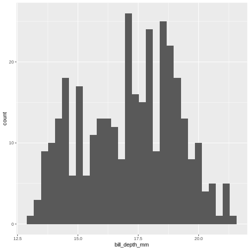

:::::::::::::::::::::::::::::::::::::: questions 

- How do you write a lesson using R Markdown and `{sandpaper}`?

::::::::::::::::::::::::::::::::::::::::::::::::

::::::::::::::::::::::::::::::::::::: objectives

- Explain how to use markdown with the new lesson template
- Demonstrate how to include pieces of code, figures, and nested challenge blocks

::::::::::::::::::::::::::::::::::::::::::::::::


``` r
library(tidyverse)
```

``` output
── Attaching core tidyverse packages ──────────────────────── tidyverse 2.0.0 ──
✔ dplyr     1.1.4     ✔ readr     2.1.5
✔ forcats   1.0.0     ✔ stringr   1.5.1
✔ ggplot2   3.5.1     ✔ tibble    3.2.1
✔ lubridate 1.9.3     ✔ tidyr     1.3.1
✔ purrr     1.0.2     
── Conflicts ────────────────────────────────────────── tidyverse_conflicts() ──
✖ dplyr::filter() masks stats::filter()
✖ dplyr::lag()    masks stats::lag()
ℹ Use the conflicted package (<http://conflicted.r-lib.org/>) to force all conflicts to become errors
```

``` r
library(palmerpenguins)
```

## How to test if our data is normally distributed?

If the statistical treatment we want to apply to our data assumes that the
data is normally distributed - we need a way to determine if it actually is
normally distributed.

What does it mean that it is normally distributed? It means that the distribution
of our data has the same properties as the normal distribution.

### Mean and median

One of the properties of the normal distribution is that the mean and median
of the data is equal. 
Let us look at the penguins:

``` r
summary(penguins)
```

``` output
      species          island    bill_length_mm  bill_depth_mm  
 Adelie   :152   Biscoe   :168   Min.   :32.10   Min.   :13.10  
 Chinstrap: 68   Dream    :124   1st Qu.:39.23   1st Qu.:15.60  
 Gentoo   :124   Torgersen: 52   Median :44.45   Median :17.30  
                                 Mean   :43.92   Mean   :17.15  
                                 3rd Qu.:48.50   3rd Qu.:18.70  
                                 Max.   :59.60   Max.   :21.50  
                                 NA's   :2       NA's   :2      
 flipper_length_mm  body_mass_g       sex           year     
 Min.   :172.0     Min.   :2700   female:165   Min.   :2007  
 1st Qu.:190.0     1st Qu.:3550   male  :168   1st Qu.:2007  
 Median :197.0     Median :4050   NA's  : 11   Median :2008  
 Mean   :200.9     Mean   :4202                Mean   :2008  
 3rd Qu.:213.0     3rd Qu.:4750                3rd Qu.:2009  
 Max.   :231.0     Max.   :6300                Max.   :2009  
 NA's   :2         NA's   :2                                 
```
The categorical variables, species, island, sex and year are of course not normally
distributed. However bill_length_mm have almost the same values of median and 
mean, as do bill_depth_mm and flipper_length_mm. But body_mass_g have a relatively
large difference between mean and median. Not that much of a surprise, since we
are looking at weights of three different species of penguins, of both sexes.

What next. A histogram of the data should look normal. Let us take a closer
look at bill_depth_mm where mean and median are closest:


``` r
penguins %>% 
  ggplot(aes(x=bill_depth_mm)) +
  geom_histogram()
```

``` output
`stat_bin()` using `bins = 30`. Pick better value with `binwidth`.
```

``` warning
Warning: Removed 2 rows containing non-finite outside the scale range
(`stat_bin()`).
```


This does not really look like a normaldistribution. The fact that mean and
median are almost identical was not a sufficient criterium for normalcy.

A better way of visualising is often density-plots:

``` r
penguins %>% 
  ggplot(aes(x=bill_depth_mm)) +
  geom_density()
```

``` warning
Warning: Removed 2 rows containing non-finite outside the scale range
(`stat_density()`).
```


We can think of this as a histogram with infinitely small bins.


``` r
penguins %>% 
  ggplot(aes(x=bill_depth_mm, color = species)) +
  geom_density()
```

``` warning
Warning: Removed 2 rows containing non-finite outside the scale range
(`stat_density()`).
```


Men i hvor høj grad ligner det faktisk en normalfordeling?

Normalfordelingens egenskaber fortæller os at 50% af observationerne skal være
større end gennemsnittet. Og 50% af observationerne skal være mindre.

For hver eneste værdi på x-aksen i plottet af normalfordelingen, ved vi hvor stor en
del af observationerne der skal være mindre eller større. 

Så tæller vi op hvordan vores observationer faktisk fordeler sig. og sammenligner 
med hvordan normalfordelingen ser ud - så kan vi se afvigelsen.

her er der link til hvad jeg har fået skrevet om percentiler i episoden
om deskriptiv statistik.

indsæt qqplot.

Punkterne kan selvfølgelig følge linien 100%. I så fald er vores data i hvert fald
normalfordelte. 

Det vi oftest ser er at punkterne i midten af plottet følger linien ret nøje. Men at 
der er afvigelser i hver ende, hvor de enten ligger over eller under linien. 
Det giver fire forskellige udfald.

Hvis punkterne ligger over linien i begge ender.

Det indikerer at data har tykkere haler end forventet. at der er flere 
ekstreme værdier, både høje og lave, end vi forventer. større kurtosis end normalfordelingen.

punkter ligger under linien i begge ender:

data har tyndere haler end forventet. Der er færre ekstreme værdier end vi ville
forvente. lavere kurtosis end normalfordelingen. 

Øvre hale over, nedre hale under.
Skæve data, hvor data er skubbet mod højere værdier. Høje værdier optræder 
hyppigere end forventet. Eller lave værdier optræder sjældnere end forventet.

øvre under, nedre over. 
skæve data. i omvendt retning relativt til umiddelbart ovenstående.

kurtosis 

skewness

kan vi sætte tal på?

Ja. kurtosis og skewness. Jo tættere skewness kommer på 0, og kurtosis minus 3 på
0, jo tættere på normalfordelt er data.

R i sig selv kan ikke beregne det. Men det kan pakken
e1071

``` r
library(e1071)
test <- rnorm(1000)
```

Skewness:

``` r
skewness(test)
```

``` output
[1] -0.1084576
```

kurtosis

``` r
kurtosis(test)
```

``` output
[1] -0.2470323
```
Bemærk at vores test-vektor er ret normal fordelt. Men ingen af parametrene er
lig 0.

Andre tests:
Shapiro-Wilk


``` r
shapiro.test(test) 
```

``` output

	Shapiro-Wilk normality test

data:  test
W = 0.99717, p-value = 0.07538
```
nul-hypotesen er her at data er normalfordelte. Hvis vi afviser null-hypotesen,vil det 
i dette tilfælde, være forkert i ca. 94% af tilfældene.

Testen er særligt godt til små stikprøver (<50, nogen siger den er ok op op til <2000)

Det er, vist nok, principielt et mål for den lineære korrelation mellem data og 
normalfordelte kvantiler - altså det vi ser i qq-plottet.

### Kolmogorov-Smirnov

vi skal specificere at det er normalfordelingen vi tester imod ("pnorm") - den kan
nemlig teste for andre fordelinger også.


``` r
ks.test(test, "pnorm", mean = mean(test), sd = sd(test))
```

``` output

	Asymptotic one-sample Kolmogorov-Smirnov test

data:  test
D = 0.026591, p-value = 0.4793
alternative hypothesis: two-sided
```
Vær forsigtig. Den forudsætter at vi kender "den sande" middelværdi og standardafvigelse,
i stedet for som i dette eksempel at estimere dem fra vores stikprøve.

NULL-hypotesen er også her at data er normalfordelte, p-værdien er her 0.99, og 
vi kan derfor ikke afvise null-hypotesen.

### Liliefors test
Den er en variation af ks-testen, der er  designet specifikt til at teste normalitet.
Og forudsætter _ikke_ at vi på forhånd kender middelværdi og standardafvigelse.


``` r
library(nortest)
lillie.test(test)
```

``` output

	Lilliefors (Kolmogorov-Smirnov) normality test

data:  test
D = 0.026591, p-value = 0.09264
```
Samme null-hypotese som før. Men læg igen mærke til at selvom data er 
designet til at være normalfordelte, så er p-værdien ikke 1. 

### Anderson-darling test

Ikke tilgængelig i R direkte:

``` r
library(nortest)
ad.test(test)
```

``` output

	Anderson-Darling normality test

data:  test
A = 0.77195, p-value = 0.0448
```
Også her er null-hypotesen at data er normaltfordelte. 


::::::::::::::::::::::::::::::::::::: keypoints 

- Use `.md` files for episodes when you want static content
- Use `.Rmd` files for episodes when you need to generate output
- Run `sandpaper::check_lesson()` to identify any issues with your lesson
- Run `sandpaper::build_lesson()` to preview your lesson locally

::::::::::::::::::::::::::::::::::::::::::::::::

