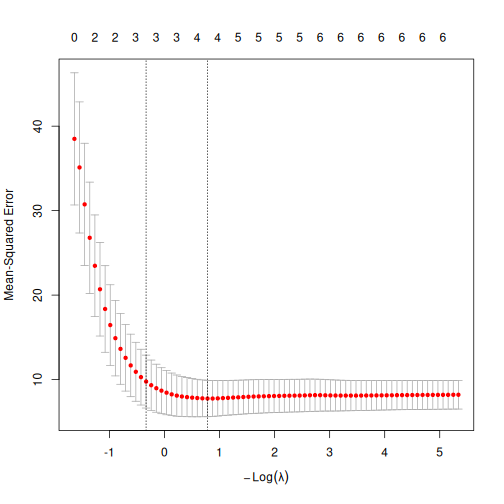

:::::::::::::::::::::::::::::::::::::: questions 

- How do we avoid overfitting in multiple linear regression?

::::::::::::::::::::::::::::::::::::::::::::::::

::::::::::::::::::::::::::::::::::::: objectives

- Explain the rationale behind regularisation in linear regresssions
- Demonstrate how to perform a LASSO-regularisation
- Demonstrate how to use cross-validation to optimise the hyperparamter.

::::::::::::::::::::::::::::::::::::::::::::::::


## Least Absolute Shrinkage and Selection Operator.

One of the risks when we build a linear model based on several predictive variables,
is that we add too many variables to the model. We should always try to 
build a parsimonius model, one that only include the variables that actually
contribute to the predictive value of the model.

Adding too many variables, can lead to overfitting, and in turn bad predictions on
new data.

But which variables should we include? 

Guessing is often a viable route to take, but we run the risk of letting our
own biases influence the model. 

Rather than guessing, techniques for letting the computer make the choices for us,
exist. 

One of these is called "LASSO" - Least Absolute Shrinkage and Selection Operator.
Probably a bacronym. 

When we normally build a linear model, we ask the algorithm to identify the
coefficients in the expression:

$$\hat{y}= \beta_0 + \beta_1x_1 + \beta_2x_2 + \beta_3x_3 +... + \beta_nx_n$$

We explicitly want a model that minimises the difference, residual, between the "true"
values of y that we know, and the prediction the model makes, $\hat{y}$. 

The algorithm that does all the work for us, do that by minimising the so called
loss-function, typically the sum of the square of the residuals:

$$RSS = \sum(y_i - \hat{y_i})^2$$

In the LASSO algorithm, we instead minimise this loss-function:

$$\sum_{i=1}^{n}(y_i - \sum_{j} x_{ij}\beta_j)^2 + \lambda\sum_{j=1}^p |\beta_j|$$

Or, a bit shorter:

$$RSS + \lambda\sum_{j=1}^p |\beta_j|$$

The additional term, $\lambda\sum_{j=1}^p |\beta_j|$ sum the absolute 
values of all the coefficients (except for the intercept), and multiplies it with
a parameter $\lambda$. 

The additional term regulates, or regularises the solution, and prevent the model from being too
flexible. We therefor call this technique LASSO-regularisation. Others exist, and LASSO is often
also called L1-regularisation.

Mathematically this has the consequence that we might get the minimum of the loss function 
by setting some coefficients $\beta$ to zero. In that way, the LASSO algorithm can eliminate
coefficients, and thereby variables in the model, that do not contribute enough to the overall model.

$\lambda$ controls how severe we punish the model for having too many or to large coefficients. 
Therefore we still have to chose the value of $\lambda$ when we build the model using LASSO regularisation.

Let us look at an example.

First of all we need a package to do the calculations for us. `glmnet` is one such package:


``` r
library(tidyverse)
library(glmnet)
```

``` output
Loading required package: Matrix
```

``` output

Attaching package: 'Matrix'
```

``` output
The following objects are masked from 'package:tidyr':

    expand, pack, unpack
```

``` output
Loaded glmnet 4.1-10
```

We are going to build a model predicting the fuel efficiency, `mpg` based on other 
parameters (cyl, disp, hp, drat, wt, qsec), in the `mtcars` dataset

First - this is the result in a ordinary linear model (OLS):


``` r
lm_model <- lm(mpg ~ cyl + disp + hp + drat + wt + qsec, data = mtcars)
coef(lm_model)
```

``` output
(Intercept)         cyl        disp          hp        drat          wt 
26.30735899 -0.81856023  0.01320490 -0.01792993  1.32040573 -4.19083238 
       qsec 
 0.40146117 
```

Some datamanipulation is needed in order to remove categorical variables. The implementation
of LASSO in `glmnet` also require that the response variable is provided in a vector, and the
predictor variables in a matrix:


``` r
y <- mtcars$mpg
x <- as.matrix(mtcars[,c(2:7)])
```

Now we are ready to run the regression with LASSO regularisation. The function is also
called `glmnet`. As mentioned other regularisation techniques exist, and we chose LASSO by
setting the argument `alpha` to 1. We also have to chose $\lambda$ ourself. We make a first 
attempt with 1.5.


``` r
L1_model <- glmnet(x,y,alpha = 1, lambda = 1.5)
coef(L1_model)
```

``` output
7 x 1 sparse Matrix of class "dgCMatrix"
                      s0
(Intercept) 33.593471359
cyl         -0.835573047
disp         .          
hp          -0.006175254
drat         .          
wt          -2.308463917
qsec         .          
```

Compare with the ordinary model:
<!--html_preserve--><div id="rtfbdmekzq" style="padding-left:0px;padding-right:0px;padding-top:10px;padding-bottom:10px;overflow-x:auto;overflow-y:auto;width:auto;height:auto;">
<style>#rtfbdmekzq table {
  font-family: system-ui, 'Segoe UI', Roboto, Helvetica, Arial, sans-serif, 'Apple Color Emoji', 'Segoe UI Emoji', 'Segoe UI Symbol', 'Noto Color Emoji';
  -webkit-font-smoothing: antialiased;
  -moz-osx-font-smoothing: grayscale;
}

#rtfbdmekzq thead, #rtfbdmekzq tbody, #rtfbdmekzq tfoot, #rtfbdmekzq tr, #rtfbdmekzq td, #rtfbdmekzq th {
  border-style: none;
}

#rtfbdmekzq p {
  margin: 0;
  padding: 0;
}

#rtfbdmekzq .gt_table {
  display: table;
  border-collapse: collapse;
  line-height: normal;
  margin-left: auto;
  margin-right: auto;
  color: #333333;
  font-size: 16px;
  font-weight: normal;
  font-style: normal;
  background-color: #FFFFFF;
  width: auto;
  border-top-style: solid;
  border-top-width: 2px;
  border-top-color: #A8A8A8;
  border-right-style: none;
  border-right-width: 2px;
  border-right-color: #D3D3D3;
  border-bottom-style: solid;
  border-bottom-width: 2px;
  border-bottom-color: #A8A8A8;
  border-left-style: none;
  border-left-width: 2px;
  border-left-color: #D3D3D3;
}

#rtfbdmekzq .gt_caption {
  padding-top: 4px;
  padding-bottom: 4px;
}

#rtfbdmekzq .gt_title {
  color: #333333;
  font-size: 125%;
  font-weight: initial;
  padding-top: 4px;
  padding-bottom: 4px;
  padding-left: 5px;
  padding-right: 5px;
  border-bottom-color: #FFFFFF;
  border-bottom-width: 0;
}

#rtfbdmekzq .gt_subtitle {
  color: #333333;
  font-size: 85%;
  font-weight: initial;
  padding-top: 3px;
  padding-bottom: 5px;
  padding-left: 5px;
  padding-right: 5px;
  border-top-color: #FFFFFF;
  border-top-width: 0;
}

#rtfbdmekzq .gt_heading {
  background-color: #FFFFFF;
  text-align: center;
  border-bottom-color: #FFFFFF;
  border-left-style: none;
  border-left-width: 1px;
  border-left-color: #D3D3D3;
  border-right-style: none;
  border-right-width: 1px;
  border-right-color: #D3D3D3;
}

#rtfbdmekzq .gt_bottom_border {
  border-bottom-style: solid;
  border-bottom-width: 2px;
  border-bottom-color: #D3D3D3;
}

#rtfbdmekzq .gt_col_headings {
  border-top-style: solid;
  border-top-width: 2px;
  border-top-color: #D3D3D3;
  border-bottom-style: solid;
  border-bottom-width: 2px;
  border-bottom-color: #D3D3D3;
  border-left-style: none;
  border-left-width: 1px;
  border-left-color: #D3D3D3;
  border-right-style: none;
  border-right-width: 1px;
  border-right-color: #D3D3D3;
}

#rtfbdmekzq .gt_col_heading {
  color: #333333;
  background-color: #FFFFFF;
  font-size: 100%;
  font-weight: normal;
  text-transform: inherit;
  border-left-style: none;
  border-left-width: 1px;
  border-left-color: #D3D3D3;
  border-right-style: none;
  border-right-width: 1px;
  border-right-color: #D3D3D3;
  vertical-align: bottom;
  padding-top: 5px;
  padding-bottom: 6px;
  padding-left: 5px;
  padding-right: 5px;
  overflow-x: hidden;
}

#rtfbdmekzq .gt_column_spanner_outer {
  color: #333333;
  background-color: #FFFFFF;
  font-size: 100%;
  font-weight: normal;
  text-transform: inherit;
  padding-top: 0;
  padding-bottom: 0;
  padding-left: 4px;
  padding-right: 4px;
}

#rtfbdmekzq .gt_column_spanner_outer:first-child {
  padding-left: 0;
}

#rtfbdmekzq .gt_column_spanner_outer:last-child {
  padding-right: 0;
}

#rtfbdmekzq .gt_column_spanner {
  border-bottom-style: solid;
  border-bottom-width: 2px;
  border-bottom-color: #D3D3D3;
  vertical-align: bottom;
  padding-top: 5px;
  padding-bottom: 5px;
  overflow-x: hidden;
  display: inline-block;
  width: 100%;
}

#rtfbdmekzq .gt_spanner_row {
  border-bottom-style: hidden;
}

#rtfbdmekzq .gt_group_heading {
  padding-top: 8px;
  padding-bottom: 8px;
  padding-left: 5px;
  padding-right: 5px;
  color: #333333;
  background-color: #FFFFFF;
  font-size: 100%;
  font-weight: initial;
  text-transform: inherit;
  border-top-style: solid;
  border-top-width: 2px;
  border-top-color: #D3D3D3;
  border-bottom-style: solid;
  border-bottom-width: 2px;
  border-bottom-color: #D3D3D3;
  border-left-style: none;
  border-left-width: 1px;
  border-left-color: #D3D3D3;
  border-right-style: none;
  border-right-width: 1px;
  border-right-color: #D3D3D3;
  vertical-align: middle;
  text-align: left;
}

#rtfbdmekzq .gt_empty_group_heading {
  padding: 0.5px;
  color: #333333;
  background-color: #FFFFFF;
  font-size: 100%;
  font-weight: initial;
  border-top-style: solid;
  border-top-width: 2px;
  border-top-color: #D3D3D3;
  border-bottom-style: solid;
  border-bottom-width: 2px;
  border-bottom-color: #D3D3D3;
  vertical-align: middle;
}

#rtfbdmekzq .gt_from_md > :first-child {
  margin-top: 0;
}

#rtfbdmekzq .gt_from_md > :last-child {
  margin-bottom: 0;
}

#rtfbdmekzq .gt_row {
  padding-top: 8px;
  padding-bottom: 8px;
  padding-left: 5px;
  padding-right: 5px;
  margin: 10px;
  border-top-style: solid;
  border-top-width: 1px;
  border-top-color: #D3D3D3;
  border-left-style: none;
  border-left-width: 1px;
  border-left-color: #D3D3D3;
  border-right-style: none;
  border-right-width: 1px;
  border-right-color: #D3D3D3;
  vertical-align: middle;
  overflow-x: hidden;
}

#rtfbdmekzq .gt_stub {
  color: #333333;
  background-color: #FFFFFF;
  font-size: 100%;
  font-weight: initial;
  text-transform: inherit;
  border-right-style: solid;
  border-right-width: 2px;
  border-right-color: #D3D3D3;
  padding-left: 5px;
  padding-right: 5px;
}

#rtfbdmekzq .gt_stub_row_group {
  color: #333333;
  background-color: #FFFFFF;
  font-size: 100%;
  font-weight: initial;
  text-transform: inherit;
  border-right-style: solid;
  border-right-width: 2px;
  border-right-color: #D3D3D3;
  padding-left: 5px;
  padding-right: 5px;
  vertical-align: top;
}

#rtfbdmekzq .gt_row_group_first td {
  border-top-width: 2px;
}

#rtfbdmekzq .gt_row_group_first th {
  border-top-width: 2px;
}

#rtfbdmekzq .gt_summary_row {
  color: #333333;
  background-color: #FFFFFF;
  text-transform: inherit;
  padding-top: 8px;
  padding-bottom: 8px;
  padding-left: 5px;
  padding-right: 5px;
}

#rtfbdmekzq .gt_first_summary_row {
  border-top-style: solid;
  border-top-color: #D3D3D3;
}

#rtfbdmekzq .gt_first_summary_row.thick {
  border-top-width: 2px;
}

#rtfbdmekzq .gt_last_summary_row {
  padding-top: 8px;
  padding-bottom: 8px;
  padding-left: 5px;
  padding-right: 5px;
  border-bottom-style: solid;
  border-bottom-width: 2px;
  border-bottom-color: #D3D3D3;
}

#rtfbdmekzq .gt_grand_summary_row {
  color: #333333;
  background-color: #FFFFFF;
  text-transform: inherit;
  padding-top: 8px;
  padding-bottom: 8px;
  padding-left: 5px;
  padding-right: 5px;
}

#rtfbdmekzq .gt_first_grand_summary_row {
  padding-top: 8px;
  padding-bottom: 8px;
  padding-left: 5px;
  padding-right: 5px;
  border-top-style: double;
  border-top-width: 6px;
  border-top-color: #D3D3D3;
}

#rtfbdmekzq .gt_last_grand_summary_row_top {
  padding-top: 8px;
  padding-bottom: 8px;
  padding-left: 5px;
  padding-right: 5px;
  border-bottom-style: double;
  border-bottom-width: 6px;
  border-bottom-color: #D3D3D3;
}

#rtfbdmekzq .gt_striped {
  background-color: rgba(128, 128, 128, 0.05);
}

#rtfbdmekzq .gt_table_body {
  border-top-style: solid;
  border-top-width: 2px;
  border-top-color: #D3D3D3;
  border-bottom-style: solid;
  border-bottom-width: 2px;
  border-bottom-color: #D3D3D3;
}

#rtfbdmekzq .gt_footnotes {
  color: #333333;
  background-color: #FFFFFF;
  border-bottom-style: none;
  border-bottom-width: 2px;
  border-bottom-color: #D3D3D3;
  border-left-style: none;
  border-left-width: 2px;
  border-left-color: #D3D3D3;
  border-right-style: none;
  border-right-width: 2px;
  border-right-color: #D3D3D3;
}

#rtfbdmekzq .gt_footnote {
  margin: 0px;
  font-size: 90%;
  padding-top: 4px;
  padding-bottom: 4px;
  padding-left: 5px;
  padding-right: 5px;
}

#rtfbdmekzq .gt_sourcenotes {
  color: #333333;
  background-color: #FFFFFF;
  border-bottom-style: none;
  border-bottom-width: 2px;
  border-bottom-color: #D3D3D3;
  border-left-style: none;
  border-left-width: 2px;
  border-left-color: #D3D3D3;
  border-right-style: none;
  border-right-width: 2px;
  border-right-color: #D3D3D3;
}

#rtfbdmekzq .gt_sourcenote {
  font-size: 90%;
  padding-top: 4px;
  padding-bottom: 4px;
  padding-left: 5px;
  padding-right: 5px;
}

#rtfbdmekzq .gt_left {
  text-align: left;
}

#rtfbdmekzq .gt_center {
  text-align: center;
}

#rtfbdmekzq .gt_right {
  text-align: right;
  font-variant-numeric: tabular-nums;
}

#rtfbdmekzq .gt_font_normal {
  font-weight: normal;
}

#rtfbdmekzq .gt_font_bold {
  font-weight: bold;
}

#rtfbdmekzq .gt_font_italic {
  font-style: italic;
}

#rtfbdmekzq .gt_super {
  font-size: 65%;
}

#rtfbdmekzq .gt_footnote_marks {
  font-size: 75%;
  vertical-align: 0.4em;
  position: initial;
}

#rtfbdmekzq .gt_asterisk {
  font-size: 100%;
  vertical-align: 0;
}

#rtfbdmekzq .gt_indent_1 {
  text-indent: 5px;
}

#rtfbdmekzq .gt_indent_2 {
  text-indent: 10px;
}

#rtfbdmekzq .gt_indent_3 {
  text-indent: 15px;
}

#rtfbdmekzq .gt_indent_4 {
  text-indent: 20px;
}

#rtfbdmekzq .gt_indent_5 {
  text-indent: 25px;
}

#rtfbdmekzq .katex-display {
  display: inline-flex !important;
  margin-bottom: 0.75em !important;
}

#rtfbdmekzq div.Reactable > div.rt-table > div.rt-thead > div.rt-tr.rt-tr-group-header > div.rt-th-group:after {
  height: 0px !important;
}
</style>
<table class="gt_table" data-quarto-disable-processing="false" data-quarto-bootstrap="false">
  <thead>
    <tr class="gt_col_headings">
      <th class="gt_col_heading gt_columns_bottom_border gt_left" rowspan="1" colspan="1" scope="col" id="coef">coef</th>
      <th class="gt_col_heading gt_columns_bottom_border gt_right" rowspan="1" colspan="1" scope="col" id="LASSO">LASSO</th>
      <th class="gt_col_heading gt_columns_bottom_border gt_right" rowspan="1" colspan="1" scope="col" id="OLS">OLS</th>
    </tr>
  </thead>
  <tbody class="gt_table_body">
    <tr><td headers="coef" class="gt_row gt_left">(Intercept)</td>
<td headers="LASSO" class="gt_row gt_right">33.593471359</td>
<td headers="OLS" class="gt_row gt_right">26.30735899</td></tr>
    <tr><td headers="coef" class="gt_row gt_left">cyl</td>
<td headers="LASSO" class="gt_row gt_right">-0.835573047</td>
<td headers="OLS" class="gt_row gt_right">-0.81856023</td></tr>
    <tr><td headers="coef" class="gt_row gt_left">disp</td>
<td headers="LASSO" class="gt_row gt_right">0.000000000</td>
<td headers="OLS" class="gt_row gt_right">0.01320490</td></tr>
    <tr><td headers="coef" class="gt_row gt_left">hp</td>
<td headers="LASSO" class="gt_row gt_right">-0.006175254</td>
<td headers="OLS" class="gt_row gt_right">-0.01792993</td></tr>
    <tr><td headers="coef" class="gt_row gt_left">drat</td>
<td headers="LASSO" class="gt_row gt_right">0.000000000</td>
<td headers="OLS" class="gt_row gt_right">1.32040573</td></tr>
    <tr><td headers="coef" class="gt_row gt_left">wt</td>
<td headers="LASSO" class="gt_row gt_right">-2.308463917</td>
<td headers="OLS" class="gt_row gt_right">-4.19083238</td></tr>
    <tr><td headers="coef" class="gt_row gt_left">qsec</td>
<td headers="LASSO" class="gt_row gt_right">0.000000000</td>
<td headers="OLS" class="gt_row gt_right">0.40146117</td></tr>
  </tbody>
  
  
</table>
</div><!--/html_preserve-->

Note that the coefficients for `disp`, `drat` and `qsec` are eliminated, or set to zero in the LASSO-regression.

But we still made a choice by setting $\lambda$ to 1.5. What is the optimal $\lambda$?

The optimal $\lambda$ is the $\lambda$ that leads to a model that best predict the response variable.

:::: challenge

Suggest one way to find the optimal $\lambda$

:::: solution
## One way of doing it - but which problems does it have?
We could do that by splitting the data in two parts, build different models on one part with 
different $\lambda$ s and use them to predict the results for the other part of the data.
The model that best predicts the data is the best, and we know which $\lambda$ was the best.
::::

:::: solution

## Some problems with this approach
Our dataset is not very large. If we pull out a fifth of the dataset for
evaluation purposes, we only have 25 observations left.

And what if the random split of our data by chance happen to be bad?
We run the risk of splitting it in a way where we do not have a
representative sample for training.
Would we get the same result if we split it in a different way?

::::
::::

### How do we handle this? 
We handle this problem with the randomness of sampling, and the limited size of our data,
by splitting (sampling) the data randomly a number of times (often 10). For each random split
we test different values of $\lambda$, and then calculate the average of how well a given 
value of $\lambda$ perform, for the 10 different splits. We can then chose the best $\lambda$,
and build a final model using that.


`glmnet` provides a function for handling all that. We can chose which $\lambda$ s the function should test, we
can chose another number of random selections (folds) than the default 10 and a lot of other details. We go with the
defaults here:


``` r
set.seed(47) # The folds are selected at random - this line of code makes those reproducable 
model <- cv.glmnet(x, y, alpha = 1)
```

Our model now contains results for many different $\lambda$s

If we plot it, we get the mean-squared-error on the y-axis. That is the value we want to minimise, and 
$\log{\lambda}$ on the x-axis:

``` r
plot(model)
```



The numbers above the plot indicates the number of variables left in the model for at given $\lambda$. To the far left, we do 
not eliminate any variables. To the far right, only two are left.

We could look at the plot and determine the best value of $\lambda$. The first is `lambda.min` which is the $\lambda$ 
that, on average, give the lowest error, and `lambda.1se` which is the largest $\lambda$ that give an error within
one standarderror of the minimum.

Which should we chose? lambda.min give us the lowest error when we want to predict values, but have more variables
left in the model. lambda.1se accepts a larger (but not large) error , but returns a simpler model.

Lets go with lambda.min

``` r
best_l <- model$lambda.min
best_l
```

``` output
[1] 0.458192
```

Now we know which lambda to use, and we can fit the overall model:


``` r
best_model <- glmnet(x,y,alpha = 1, lambda = best_l)
coef(best_model)
```

``` output
7 x 1 sparse Matrix of class "dgCMatrix"
                     s0
(Intercept) 36.29975118
cyl         -0.87369436
disp         .         
hp          -0.01497565
drat         0.16884990
wt          -2.86383756
qsec         .         
```


::::::::::::::::::::::::::::::::::::: keypoints 

- It is important to avoid overfitting in multiple linear regression.
- LASSO can remove unnessecary variables in linear models.
- Cross validation can optimise the LASSO regularisation.

::::::::::::::::::::::::::::::::::::::::::::::::

