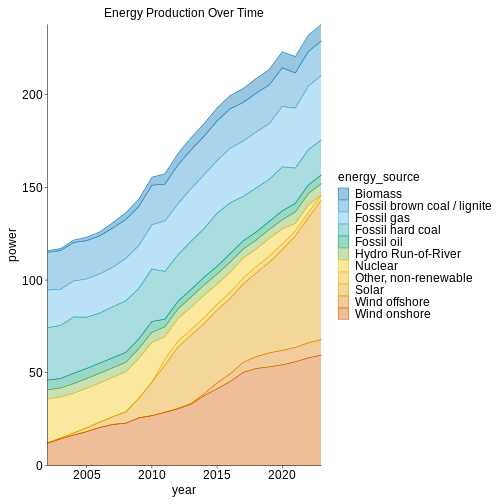

:::::::::::::::::::::::::::::::::::::: questions 

- How do you write a lesson using R Markdown and `{sandpaper}`?

::::::::::::::::::::::::::::::::::::::::::::::::

::::::::::::::::::::::::::::::::::::: objectives

- Explain how to use markdown with the new lesson template
- Demonstrate how to include pieces of code, figures, and nested challenge blocks

::::::::::::::::::::::::::::::::::::::::::::::::

## Introduction

It is still tidy - so we stay in the tidyverse dialect which we prefer.

But it is quite different:


``` r
library(tidyplots)
energy %>%
    tidyplot(x = year, y = power, color = energy_source) %>%
    add_areastack_absolute() %>%
    adjust_size(width = NA, height = NA) %>%
    adjust_font(fontsize = 12) %>%
    add_title("Energy Production Over Time")
```



plottypes

colors

adjusting

titels og labels


::::::::::::::::::::::::::::::::::::: keypoints 

- Use `.md` files for episodes when you want static content
- Use `.Rmd` files for episodes when you need to generate output
- Run `sandpaper::check_lesson()` to identify any issues with your lesson
- Run `sandpaper::build_lesson()` to preview your lesson locally

::::::::::::::::::::::::::::::::::::::::::::::::

