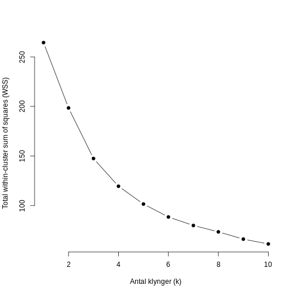

:::::::::::::::::::::::::::::::::::::: questions 

- What k should I chose in my kmeans clustering?

::::::::::::::::::::::::::::::::::::::::::::::::

::::::::::::::::::::::::::::::::::::: objectives

- Explain how to tune the hyperparameter k in kmeans


::::::::::::::::::::::::::::::::::::::::::::::::


We know how to run a kmeans clustering on our data.

But one question remains. What k should we chose? 

det kalder vi også at tune hyperparameteren. 

hvorfor hyper? 

Det kræver at vi har et mål for om resultatet er godt.

Hvor kommer det fra når vi ikke kender de sande værdier?

Undervurder i øvrigt ikke fænomenet domæne viden. Jeg kan
clustre dine data til perfektion. men hvis du ved at der skal
være 5 clustre, er der ikke nødvendigvis meget gode grunde til
at vælge 7 (men prøv lige alligevel, det kunne være at der
var noget du ikke vidste.)


``` r
# Simulerer noget data
set.seed(123)
data <- matrix(rnorm(300), ncol = 3)

# Beregn WSS for k = 1 til 10
wss <- sapply(1:10, function(k){
  kmeans(data, centers = k, nstart = 20)$tot.withinss
})

# Plot WSS vs. antal klynger
plot(1:10, wss, type = "b", pch = 19, frame = FALSE,
     xlab = "Antal klynger (k)",
     ylab = "Total within-cluster sum of squares (WSS)")
```




``` r
# Installer og load nødvendige pakker
# install.packages("cluster")
library(cluster)

set.seed(123)
# Simulerer et datasæt med 100 observationer og 3 variable
data <- matrix(rnorm(300), ncol = 3)

# Vælg et interval for antal klynger (k)
k_values <- 2:10  # Silhouette kræver mindst 2 klynger

# Initialiser en vektor til at gemme gennemsnitlig silhuet-bredde
avg_silhouette <- numeric(length(k_values))

# Beregn k-means clustering og silhuet for hvert k
for(i in seq_along(k_values)) {
  k <- k_values[i]
  km_res <- kmeans(data, centers = k, nstart = 25)
  # Beregn afstanden mellem observationerne
  diss <- dist(data)
  # Beregn silhuet-værdierne for den opnåede clustering
  sil <- silhouette(km_res$cluster, diss)
  # Gem den gennemsnitlige silhuet-bredde
  avg_silhouette[i] <- mean(sil[, 3])
}

# Plot den gennemsnitlige silhuet-bredde for hvert k
plot(k_values, avg_silhouette, type = "b", pch = 19, frame = FALSE,
     xlab = "Antal klynger (k)",
     ylab = "Gennemsnitlig silhuet-bredde",
     main = "Silhouette-metoden til valg af k")
```


``` r
# Find det optimale k (hvor gennemsnitlig silhuet er størst)
optimal_k <- k_values[which.max(avg_silhouette)]
cat("Optimalt antal klynger ifølge silhouette-metoden er:", optimal_k, "\n")
```

``` output
Optimalt antal klynger ifølge silhouette-metoden er: 6 
```

``` r
# Installer og load nødvendige pakker
# install.packages("cluster")
library(cluster)

set.seed(123)
# Simuler et datasæt med 100 observationer og 3 variable
data <- matrix(rnorm(300), ncol = 3)

# Beregn gap-statistikken for klynger fra 1 til 10
gap_stat <- clusGap(data,
                    FUN = kmeans,
                    nstart = 25,
                    K.max = 10,
                    B = 50)  # B er antallet af bootstrap-replikationer

# Vis gap-statistikken
print(gap_stat, method = "firstmax")
```

``` output
Clustering Gap statistic ["clusGap"] from call:
clusGap(x = data, FUNcluster = kmeans, K.max = 10, B = 50, nstart = 25)
B=50 simulated reference sets, k = 1..10; spaceH0="scaledPCA"
 --> Number of clusters (method 'firstmax'): 1
          logW   E.logW       gap     SE.sim
 [1,] 3.963826 4.441487 0.4776613 0.02498523
 [2,] 3.807349 4.233483 0.4261336 0.02539433
 [3,] 3.649488 4.085792 0.4363040 0.02790699
 [4,] 3.546001 3.961003 0.4150029 0.03199243
 [5,] 3.460285 3.858558 0.3982727 0.02996649
 [6,] 3.392734 3.767463 0.3747299 0.02782729
 [7,] 3.333614 3.691194 0.3575803 0.02710658
 [8,] 3.278133 3.623151 0.3450172 0.02665343
 [9,] 3.223328 3.563249 0.3399207 0.02649002
[10,] 3.184523 3.509952 0.3254286 0.02753950
```

``` r
# Plot gap-statistikken
plot(gap_stat, main = "Gap-statistik til valg af antal klynger")
```


::::::::::::::::::::::::::::::::::::: keypoints 

- Use `.md` files for episodes when you want static content
- Use `.Rmd` files for episodes when you need to generate output
- Run `sandpaper::check_lesson()` to identify any issues with your lesson
- Run `sandpaper::build_lesson()` to preview your lesson locally

::::::::::::::::::::::::::::::::::::::::::::::::

